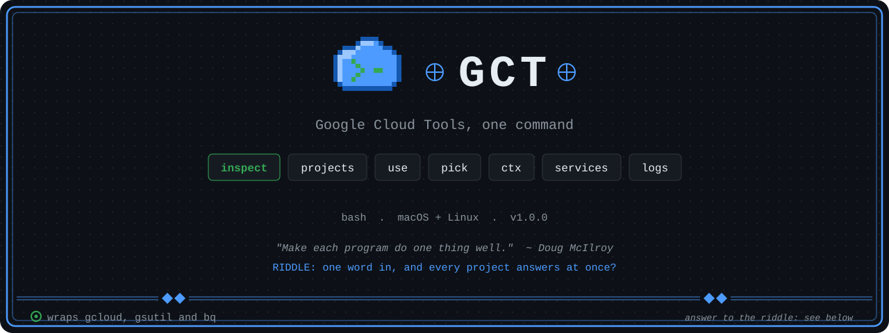

<p align="center">
  
</p>

<h1 align="center"> gct — Google Cloud Tools</h1>

<p align="center">
  A unified CLI for inspecting and managing GCP resources across all your projects.
</p>

<p align="center">
  
  
  
  
</p>

---

<details>
<summary>Riddle answer</summary>

gct inspect: it surveys Cloud Run, Cloud SQL, Secret Manager, Pub/Sub and more across all accessible GCP projects in one pass.

</details>

## About

`gct` (Google Cloud Tools) is a single-command CLI that wraps `gcloud`, `gsutil`, and `bq` into a consistent, human-friendly interface for day-to-day GCP operations. Instead of remembering a dozen `gcloud <service> list --project=... --format=...` incantations, you get one entrypoint with tab-complete-friendly subcommands, colored output, and useful defaults.

It is particularly useful if you manage **multiple GCP projects** — `gct inspect` will survey every project you have access to in one pass, showing Cloud Run, Cloud SQL, Secret Manager, Pub/Sub, Firestore, Compute VMs, and more in a structured table layout.

Requires: `gcloud` SDK installed and authenticated (`gcloud auth login`).

---

## Quick Start

```bash
# Clone
git clone https://github.com/alcatraz627/my-gcp-tools.git
cd my-gcp-tools

# Install (symlinks gct into /usr/local/bin)
bash install.sh

# Verify
gct
```

> **No-install option:** Add the repo directory to your `$PATH`, or call `bash /path/to/gct` directly.

---

## Commands

| Command | Description |
|---|---|
| `gct inspect` | Full resource survey across **all** accessible projects |
| `gct inspect PROJECT_ID` | Narrow survey to a single project |
| `gct projects` | List all accessible projects with state |
| `gct use PROJECT_ID` | Switch the active (default) project |
| `gct pick` | Interactive fuzzy project picker (requires `fzf`) |
| `gct ctx` | Show active account, project, region at a glance |
| `gct ctx --full` | Dump the full `gcloud config` |
| `gct services` | List enabled APIs for the active project |
| `gct services --all` | Enabled APIs across all projects |
| `gct services --filter KEYWORD` | Filter APIs by keyword (e.g. `run`, `sql`, `ai`) |
| `gct logs SERVICE` | Tail last 100 Cloud Run log lines |
| `gct logs SERVICE --severity ERROR` | Filter by severity: `DEBUG INFO WARNING ERROR CRITICAL` |
| `gct logs SERVICE --follow` | Live log polling (10 s interval) |
| `gct logs SERVICE --limit N` | Override log line count |
| `gct help` | Print this command reference |
| `gct version` | Print the version |

---

## What `gct inspect` Checks

Per project, the survey covers:

- **Enabled APIs** — non-default services enabled in the project
- **Cloud Run** — services (HTTP) and jobs (batch)
- **Cloud Functions** — gen1 and gen2
- **GCS Buckets** — object storage
- **Cloud SQL** — managed databases (PostgreSQL, MySQL, SQL Server)
- **Pub/Sub** — topics and subscriptions
- **Firestore** — NoSQL document databases
- **BigQuery** — data warehouse datasets
- **Secret Manager** — encrypted secrets
- **Cloud Scheduler** — cron jobs
- **Artifact Registry** — container image and package repos
- **Compute Engine** — VM instances
- **VPC Networks** — virtual networks and routing mode
- **IAM Service Accounts** — machine identities

---

## Project Structure

```
my-gcp-tools/
├── gct                  # Main dispatcher entrypoint
├── commands/
│   ├── inspect.sh       # Full resource survey
│   ├── logs.sh          # Cloud Run log tailing
│   ├── services.sh      # Enabled API listing
│   ├── projects.sh      # Project listing / switching / picker
│   └── ctx.sh           # Config + auth context
├── lib/
│   ├── colors.sh        # ANSI color helpers shared across commands
│   └── common.sh        # Shared utilities (project resolution, auth check)
└── install.sh           # Symlink installer
```

---

## Requirements

| Dependency | Purpose | Install |
|---|---|---|
| `gcloud` SDK | Core GCP API calls | [cloud.google.com/sdk](https://cloud.google.com/sdk/docs/install) |
| `gsutil` | GCS bucket listing (bundled with gcloud) | bundled |
| `bq` | BigQuery dataset listing (bundled with gcloud) | bundled |
| `fzf` | Interactive project picker (`gct pick`) | `brew install fzf` |

---

## License

MIT — see [LICENSE](LICENSE).
